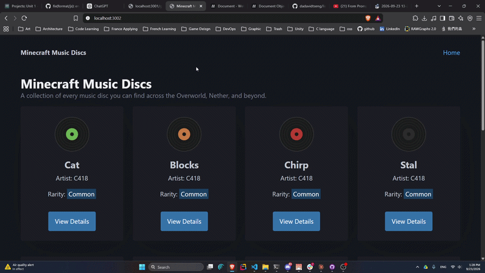

# WEB103 Project 1 - *Minecraft Music Discs*

Submitted by: **Yu-Wei Tseng**

About this web app: **A listicle of Minecraft music discs — browse every disc you can find across the Overworld, Nether, and beyond. View details like artist, rarity, duration, and where to find each one.**

Time spent: **2** hours

## Required Features

The following **required** functionality is completed:

- [x] **The web app uses only HTML, CSS, and JavaScript without a frontend framework**
- [x] **The web app displays a title**
- [x] **The web app displays at least five unique list items, each with at least three displayed attributes (such as title, text, and image)**
- [x] **The user can click on each item in the list to see a detailed view of it, including all database fields**
  - [x] **Each detail view should be a unique endpoint, such as as `localhost:3002/tracks/1` and `localhost:3002/tracks/5`**
  - [x] *Note: When showing this feature in the video walkthrough, please show the unique URL for each detailed view. We will not be able to give points if we cannot see the implementation* 
- [x] **The web app serves an appropriate 404 page when no matching route is defined**
- [x] **The web app is styled using Picocss**

The following **optional** features are implemented:

- [x] The web app displays items in a unique format, such as cards rather than lists or animated list items

The following **additional** features are implemented:

- [x] Inline SVG disc images with unique colors per track — no external image dependencies
- [x] Dark theme using PicoCSS data-theme attribute
- [x] Responsive grid layout that adapts to viewport width

## Video Walkthrough

Here's a walkthrough of implemented required features:

## Notes

Describe any challenges encountered while building the app or any additional context you'd like to add.

## License

Copyright 2026 Yu-Wei Tseng

Licensed under the Apache License, Version 2.0 (the "License"); you may not use this file except in compliance with the License. You may obtain a copy of the License at

> http://www.apache.org/licenses/LICENSE-2.0

Unless required by applicable law or agreed to in writing, software distributed under the License is distributed on an "AS IS" BASIS, WITHOUT WARRANTIES OR CONDITIONS OF ANY KIND, either express or implied. See the License for the specific language governing permissions and limitations under the License.
