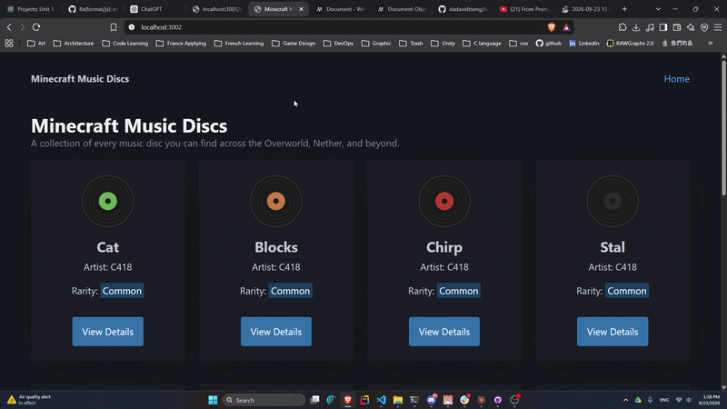
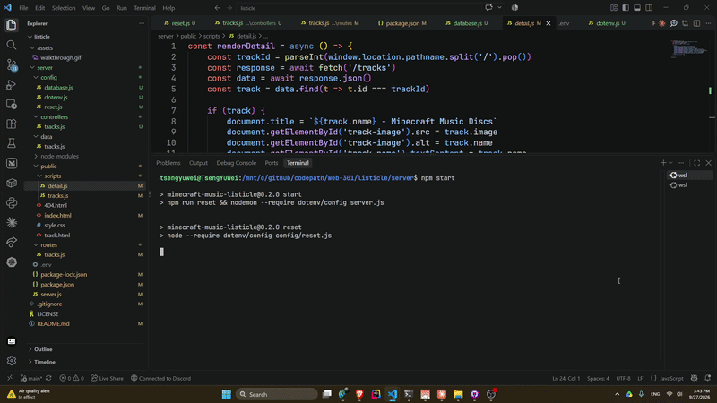

# WEB103 Project 2 - *Minecraft Music Discs*

Submitted by: **Yu-Wei Tseng**

About this web app: **A listicle of Minecraft music discs powered by a PostgreSQL database — browse every disc you can find across the Overworld, Nether, and beyond. View details like artist, rarity, duration, and where to find each one.**

Time spent: **3** hours

## Required Features

The following **required** functionality is completed:

- [x] **The web app uses only HTML, CSS, and JavaScript without a frontend framework**
- [x] **The web app is connected to a PostgreSQL database, with an appropriately structured database table for the list items**
  - [x] **NOTE: Your walkthrough added to the README must include a view of your Render dashboard demonstrating that your Postgres database is available**
  - [x] **NOTE: Your walkthrough added to the README must include a demonstration of your table contents. Use the psql command 'SELECT * FROM tablename;' to display your table contents.**

The following **optional** features are implemented:

- [x] The user can search for items by a specific attribute

The following **additional** features are implemented:

- [x] Inline SVG disc images with unique colors per track — no external image dependencies
- [x] Dark theme using PicoCSS data-theme attribute
- [x] Responsive grid layout that adapts to viewport width

## Video Walkthrough

Here's a walkthrough of implemented required features:

## Notes

Describe any challenges encountered while building the app or any additional context you'd like to add.

## License

Copyright 2026 Yu-Wei Tseng

Licensed under the Apache License, Version 2.0 (the "License"); you may not use this file except in compliance with the License. You may obtain a copy of the License at

> http://www.apache.org/licenses/LICENSE-2.0

Unless required by applicable law or agreed to in writing, software distributed under the License is distributed on an "AS IS" BASIS, WITHOUT WARRANTIES OR CONDITIONS OF ANY KIND, either express or implied. See the License for the specific language governing permissions and limitations under the License.
